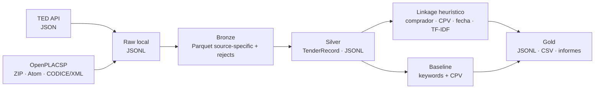
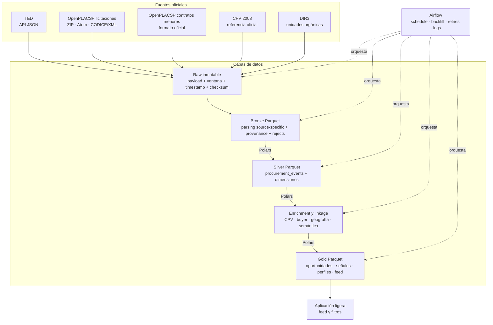

# Arquitectura técnica

## 1. Alcance

El objetivo es construir una plataforma de datos reproducible para integrar
fuentes oficiales de contratación pública y producir información útil para
proveedores. Una empresa podrá definir qué vende, dónde opera y qué rango de
contratos le interesa; los productos Gold servirán para construir un feed
diario de oportunidades y señales de mercado.

El pipeline será generalista respecto al sector. CPV proporciona la taxonomía
oficial y la tecnología se utilizará como caso de estudio en la memoria. La
clasificación semántica es un enriquecimiento del dato, no la contribución
principal del TFM.

Este documento separa deliberadamente el sistema que existe hoy de la
arquitectura objetivo. Los componentes marcados como planificados no deben
presentarse como resultados implementados.

## 2. Implementación actual

La versión 0.1 ejecuta un proceso batch local mediante una CLI:



Los adaptadores y parsers están implementados con la biblioteca estándar de
Python. `run` no accede a la red: descubre los ficheros raw, normaliza los
registros, pliega actualizaciones, calcula enlace y clasificación, evalúa la
calidad y escribe las salidas.

Esta base tiene limitaciones conocidas: no mantiene estado de ventanas de
ingesta, no garantiza la completitud de una descarga, usa el timestamp de
actualización de PLACSP como fecha publicada, separa el estado de ingesta de los
gates de calidad Silver/Gold y el enlace todavía puede comparar avisos de la
misma fuente. Estas
limitaciones se corregirán en cambios separados y verificables.

## 3. Arquitectura objetivo P0

La arquitectura acordada conserva los parsers que ya funcionan y cambia los
límites de persistencia, modelado y operación:



Airflow será un plano de control sobre funciones de pipeline independientes.
La lógica de negocio seguirá en el paquete Python para poder probarla y
ejecutarla sin levantar el orquestador.

## 4. Componentes y tecnologías

| Componente | Responsabilidad | Tecnología P0 | Estado |
| --- | --- | --- | --- |
| Adaptador TED | Descargar avisos por ventanas y conservar la respuesta oficial | Python, API JSON de TED | Implementado; falta generalizar e incrementalizar |
| Adaptador OpenPLACSP | Descargar y validar ZIP; parsear Atom y CODICE | Python, `zipfile`, XML, TLS FNMT | Implementado para licitaciones; falta estado incremental |
| Contratos menores | Incorporar señales de contratación de menor importe | Python y formato oficial por determinar | Planificado |
| Raw | Conservar bytes y procedencia sin sobrescrituras silenciosas | Sistema de ficheros local, checksum SHA-256 | Parcial |
| Bronze | Representar el resultado del parsing y sus rechazos | Polars y Parquet | Implementado con métricas por fuente; payload source-specific en JSON string |
| Silver | Mantener entidades canónicas tipadas | Polars y Parquet | Contrato definido; migración de persistencia planificada |
| Referencias | Resolver CPV y organismos mediante identificadores oficiales | CPV 2008 y DIR3 | CPV disponible; dimensiones planificadas |
| Linkage | Detectar avisos equivalentes entre fuentes con evidencia | Python/Polars, reglas explicables y similitud textual | Baseline implementado con correcciones pendientes |
| Enrichment semántico | Añadir etiquetas de negocio multilabel auditables | Modelo preentrenado versionado | Planificado |
| Gold | Publicar productos reproducibles para análisis y feed | Polars y Parquet; CSV solo como export | Baseline JSONL/CSV implementado |
| Orquestación | Programación diaria, backfill, retries y logs | Airflow | Planificado |
| Aplicación | Demostrar el consumo de productos Gold | Aplicación web ligera | Fuera del núcleo del pipeline |

## 5. Modelo Silver

La entidad central definida es `silver.procurement_events`. Su grano es un
evento o estado publicado por una fuente y asociado, cuando sea posible, a un
procedimiento. Debe separar como mínimo:

```text
event_id              procedure_id
source                source_event_type
buyer_id              buyer_name
title                 description
cpv_codes             status
estimated_value       awarded_value
currency              nuts_code
country               source_url
publication_date      source_updated_at
deadline              ingested_at
```

El modelo se completa con dimensiones `buyers`, `cpv`, `regions` y, cuando las
fuentes lo permitan, `suppliers`. Las uniones deben utilizar códigos oficiales
antes que nombres normalizados. El cambio desde `TenderRecord` se hará mediante
una frontera de compatibilidad para no migrar todo el pipeline en un único PR.

## 6. Histórico e incremental

Cada fuente debe admitir backfills por rango temporal y una ejecución diaria
reejecutable. El estado mínimo de una ventana incluye fuente, inicio y fin,
particiones esperadas y descargadas, checksums, estado y timestamps de
ejecución.

Las reglas operativas son:

1. una misma ventana puede repetirse sin generar duplicados;
2. un payload idéntico se reconoce mediante checksum;
3. un payload corregido no sobrescribe la evidencia raw anterior;
4. una ventana incompleta no se marca como correcta;
5. un pequeño lookback permite recoger retrasos y correcciones;
6. las revisiones y anulaciones se resuelven de forma explícita.

## 7. Linkage y enriquecimiento

El linkage solo compara registros de fuentes distintas. La generación de
candidatos utilizará señales estructuradas comprensibles —comprador, CPV y
ventana temporal— y una similitud textual para ordenar o decidir candidatos.
Todos los candidatos cruzados dentro de la ventana se evalúan, sin recorte
ni muestreo por tamaño de bloque; nunca desaparecen de las métricas.

CPV seguirá siendo la clasificación oficial primaria. El enriquecimiento
semántico añadirá etiquetas de negocio generalistas y multilabel, conservando
el nombre, revisión y score del modelo. El clasificador actual de reglas se
mantendrá como baseline de coste bajo y comportamiento interpretable.

No se entrenará un modelo two-tower: no existe interacción empresa-oportunidad
suficiente para justificarlo. Una similitud entre embeddings de perfil y
contrato puede evaluarse como mejora opcional del ranking.

## 8. Productos Gold

P0 contempla tres productos con semánticas distintas:

- `open_opportunities`: procedimientos abiertos y accionables;
- `minor_contract_signals`: histórico de compras de menor importe, útil como
  señal comercial pero no como concurso abierto;
- `daily_candidate_feed`: candidatos ordenados mediante componentes de score
  almacenados y explicables.

La primera versión del ranking combinará únicamente señales disponibles y
auditables, como encaje CPV, geografía, presupuesto e historial del comprador.
La relevancia semántica solo se añadirá cuando exista un enrichment real.

## 9. Calidad y evidencia

Los informes deben permitir distinguir ventanas solicitadas y descargadas,
registros parseados, aceptados y rechazados, completitud de campos críticos,
integridad de referencias, frescura y trabajo de linkage evaluado o no
evaluado. Un filtro previo no puede convertir datos defectuosos en un informe
verde.

Los conteos, tiempos o métricas de modelos se considerarán resultados solo si
pueden reproducirse desde código, configuración y artefactos conservados. Las
estimaciones y los diseños futuros se etiquetarán como tales.

## 10. Decisiones de alcance

- Polars es el motor tabular P0 y Parquet el formato analítico principal.
- Spark solo se estudiará si una medición del backfill muestra una necesidad o
  permite plantear un benchmark concreto.
- dbt solo tendrá sentido si se incorpora un serving layer SQL con un papel
  claro.
- No se añaden infraestructura distribuida, Kubernetes, streaming ni un
  lakehouse complejo para cumplir una lista de tecnologías.
- La aplicación web demuestra el consumo; la contribución académica permanece
  en el pipeline y su operación reproducible.
