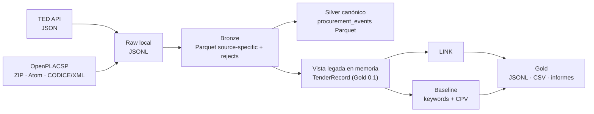
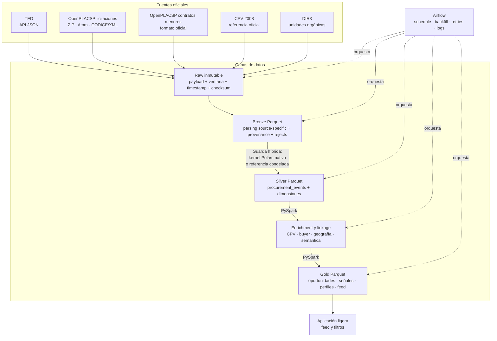

# Arquitectura técnica

## 1. Alcance

El objetivo es construir una plataforma de datos reproducible para integrar
fuentes oficiales de contratación pública y producir información útil para
proveedores. Una empresa podrá definir qué vende, dónde opera y qué rango de
contratos le interesa; los productos Gold servirán para construir un feed
diario de oportunidades y señales de mercado.

El pipeline será generalista respecto al sector. CPV proporciona la taxonomía
oficial y la tecnología se utilizará como caso de estudio en la memoria. La
clasificación semántica es un enriquecimiento del dato, no la contribución
principal del TFM.

Este documento separa deliberadamente el sistema que existe hoy de la
arquitectura objetivo. Los componentes marcados como planificados no deben
presentarse como resultados implementados.

## 2. Implementación actual

La versión 0.1 ejecuta un proceso batch local mediante una CLI:



Los adaptadores y parsers están implementados con la biblioteca estándar de
Python. `run` no accede a la red: descubre los ficheros raw, normaliza los
registros, construye Silver canónico desde todos los registros y tombstones de
Bronze con la ruta híbrida (guarda de elegibilidad que decide por batch entre
el kernel nativo de Polars y la referencia congelada), y alimenta una vista
legada en memoria
(`TenderRecord`) con el snapshot más reciente para Gold 0.1, que calcula
enlace y clasificación, evalúa la calidad y escribe las salidas. La
semántica exacta de Silver canónico está congelada en una implementación de
referencia python-row (`silver_reference.py`) que actúa como oráculo de
paridad en tests y benchmarks.

Esta base tiene limitaciones conocidas: no mantiene estado de ventanas de
ingesta, no garantiza la completitud de una descarga, la vista legada todavía
reutiliza el timestamp de actualización de PLACSP como fecha publicada y
separa el estado de ingesta de los gates de calidad. Estas
limitaciones se corregirán en cambios separados y verificables.

## 3. Arquitectura objetivo P0

La arquitectura acordada conserva los parsers que ya funcionan y cambia los
límites de persistencia, modelado y operación:



Airflow será un plano de control sobre funciones de pipeline independientes.
La lógica de negocio seguirá en el paquete Python para poder probarla y
ejecutarla sin levantar el orquestador.

La asignación de motores objetivo es: Python (biblioteca estándar) solo para
API, sistema de ficheros, ZIP/XML/parsing JSON y metadatos pequeños de
control; Polars para lotes acotados de parsing, dimensiones locales CPV/DIR3
y exportaciones acotadas; PySpark para joins grandes/transversales, ventanas,
dedup/chequeos de colisión, enriquecimiento, generación de candidatos de
linkage y Gold de alta cardinalidad. Parquet es el formato entre etapas. Unos
200.000 filas son una heurística de enrutado, no un umbral rígido: la forma
de la carga (joins, ventanas, cardinalidad, estado) es decisiva.

Decisión medida para Silver canónico (ver
[benchmarks](benchmarks.md) y la evidencia del experimento de motores
curada en `experiments/silver_engine_comparison/`):
la ruta productiva es **híbrida con guarda de elegibilidad**. Antes de
ejecutar nada, `silver_guard.py` inspecciona el batch completo (records y
tombstones) con el parser JSON de CPython y admite solo el dominio nativo
estrecho documentado allí (documento completo dentro del dominio del parser:
máximo 64 contenedores anidados, enteros de 64 bits, flotantes finitos y
sin separadores U+001C–U+001F; identidades de texto, texto localizado plano,
CPV de cadenas, importes decimales simples, países ASCII, fechas estrictas,
instantes RFC 3339 estrictos, tombstones PLACSP completos); si una sola fila
queda fuera, el batch completo se procesa con la referencia python-row congelada
sobre los frames originales, conservando valores, orden del primer error y
mensajes. Ambas rutas emiten el mismo contrato canónico (esquema
`PROCUREMENT_EVENT_SCHEMA`, identidad, revisiones, tombstones, semántica de
colisión explícita y selección de procedencia), y la ruta elegida se
registra una vez por batch; una ejecución con fallback nunca se etiqueta
como nativa. El contrato es independiente del motor por construcción: la
referencia congelada (`silver_reference.py`) y el kernel Polars
(`silver_native.py`) consumen el mismo Bronze Parquet y los tests de
paridad (`tests/test_silver_native.py`) cubren ambas rutas y la frontera.
Se conserva además un candidato PySpark evaluado como ruta de scale-out para
despliegues mayores, sin conectarlo todavía al pipeline productivo; su
paridad medida se limita al contrato sintético TED/PLACSP del experimento
(payloads escalares, CPV como listas de cadenas e instantes con segundos
enteros) y no cubre BOE ni instantes con fracción de segundo. Bronze
acotado, Airflow y la migración completa se abordan en cambios separados.

## 4. Componentes y tecnologías

| Componente | Responsabilidad | Tecnología P0 | Estado |
| --- | --- | --- | --- |
| Adaptador TED | Descargar avisos por ventanas y conservar la respuesta oficial | Python, API JSON de TED | Implementado; falta generalizar e incrementalizar |
| Adaptador OpenPLACSP | Descargar y validar ZIP; parsear Atom y CODICE | Python, `zipfile`, XML, TLS FNMT | Implementado para licitaciones; falta estado incremental |
| Contratos menores | Incorporar señales de contratación de menor importe | Python y formato oficial por determinar | Planificado |
| Raw | Conservar bytes y procedencia sin sobrescrituras silenciosas | Sistema de ficheros local, checksum SHA-256 | Parcial |
| Bronze | Representar el resultado del parsing y sus rechazos | Python para parsing; Polars para lotes acotados; Parquet | Implementado con métricas por fuente; payload source-specific en JSON string |
| Silver | Mantener entidades canónicas tipadas | Ruta híbrida: guarda de elegibilidad en Python + kernel Polars nativo para el dominio admitido, referencia python-row congelada para el resto (mismos frames); candidato PySpark de scale-out con paridad acreditada solo sobre el contrato sintético TED/PLACSP | `procurement_events` implementado con historial completo; guarda y fallback cubiertos por tests; Gold 0.1 sigue en la frontera `TenderRecord` en memoria |
| Referencias | Resolver CPV y organismos mediante identificadores oficiales | CPV 2008 y DIR3; construcción local acotada con Polars | CPV disponible; dimensiones planificadas |
| Linkage | Detectar avisos equivalentes entre fuentes con evidencia | PySpark para generación de candidatos; reglas explicables y similitud textual | Baseline cross-source implementado |
| Enrichment semántico | Añadir etiquetas de negocio multilabel auditables | PySpark + modelo preentrenado versionado | Planificado |
| Gold | Publicar productos reproducibles para análisis y feed | PySpark y Parquet; CSV solo como export acotado | Baseline JSONL/CSV implementado |
| Orquestación | Programación diaria, backfill, retries y logs | Airflow | Planificado |
| Aplicación | Demostrar el consumo de productos Gold | Aplicación web ligera | Fuera del núcleo del pipeline |

## 5. Modelo Silver

La entidad central definida es `silver.procurement_events`. Su grano es un
evento o estado publicado por una fuente y asociado, cuando sea posible, a un
procedimiento. Debe separar como mínimo:

```text
event_id              procedure_id
source                source_event_type
buyer_id              buyer_name
title                 description
cpv_codes             status
estimated_value       awarded_value
currency              nuts_code
country               source_url
publication_date      source_updated_at
deadline              ingested_at
```

El modelo se completa con dimensiones `buyers`, `cpv`, `regions` y, cuando las
fuentes lo permitan, `suppliers`. Las uniones deben utilizar códigos oficiales
antes que nombres normalizados. La transformación Bronze→Silver canónica ya
está implementada con identidad determinista por fuente, deduplicación
explícita de observaciones repetidas y fallo ante colisiones materiales; la
migración de Gold y del enlace a esta entidad se hará mediante una frontera de
compatibilidad para no reescribir todo el pipeline en un único PR.

## 6. Histórico e incremental

Cada fuente debe admitir backfills por rango temporal y una ejecución diaria
reejecutable. El estado mínimo de una ventana incluye fuente, inicio y fin,
particiones esperadas y descargadas, checksums, estado y timestamps de
ejecución.

Las reglas operativas son:

1. una misma ventana puede repetirse sin generar duplicados;
2. un payload idéntico se reconoce mediante checksum;
3. un payload corregido no sobrescribe la evidencia raw anterior;
4. una ventana incompleta no se marca como correcta;
5. un pequeño lookback permite recoger retrasos y correcciones;
6. las revisiones y anulaciones se resuelven de forma explícita.

## 7. Linkage y enriquecimiento

El linkage solo compara registros de fuentes distintas. La generación de
candidatos utilizará señales estructuradas comprensibles —comprador, CPV y
ventana temporal— y una similitud textual para ordenar o decidir candidatos.
Todos los candidatos cruzados dentro de la ventana se evalúan, sin recorte
ni muestreo por tamaño de bloque; nunca desaparecen de las métricas.

CPV seguirá siendo la clasificación oficial primaria. El enriquecimiento
semántico añadirá etiquetas de negocio generalistas y multilabel, conservando
el nombre, revisión y score del modelo. El clasificador actual de reglas se
mantendrá como baseline de coste bajo y comportamiento interpretable.

No se entrenará un modelo two-tower: no existe interacción empresa-oportunidad
suficiente para justificarlo. Una similitud entre embeddings de perfil y
contrato puede evaluarse como mejora opcional del ranking.

## 8. Productos Gold

P0 contempla tres productos con semánticas distintas:

- `open_opportunities`: procedimientos abiertos y accionables;
- `minor_contract_signals`: histórico de compras de menor importe, útil como
  señal comercial pero no como concurso abierto;
- `daily_candidate_feed`: candidatos ordenados mediante componentes de score
  almacenados y explicables.

La primera versión del ranking combinará únicamente señales disponibles y
auditables, como encaje CPV, geografía, presupuesto e historial del comprador.
La relevancia semántica solo se añadirá cuando exista un enrichment real.

## 9. Calidad y evidencia

Los informes deben permitir distinguir ventanas solicitadas y descargadas,
registros parseados, aceptados y rechazados, completitud de campos críticos,
integridad de referencias, frescura y trabajo de linkage evaluado o no
evaluado. Un filtro previo no puede convertir datos defectuosos en un informe
verde.

Los conteos, tiempos o métricas de modelos se considerarán resultados solo si
pueden reproducirse desde código, configuración y artefactos conservados. Las
estimaciones y los diseños futuros se etiquetarán como tales.

## 10. Decisiones de alcance

- La asignación de motores es autoritativa: Airflow como plano de control
  sobre funciones de pipeline independientes; Python solo para API, sistema
  de ficheros, ZIP/XML/parsing JSON y metadatos pequeños de control; Polars
  para lotes acotados de parsing, dimensiones locales CPV/DIR3, Silver
  canónico (guarda de elegibilidad que decide por batch entre el kernel
  nativo y la referencia congelada) y
  exportaciones acotadas; PySpark para joins grandes/transversales,
  ventanas, dedup/chequeos de colisión, enriquecimiento, generación de
  candidatos de linkage, Gold de alta cardinalidad y, si un despliegue mayor
  lo justifica, un backend Silver de scale-out tras productionizarlo;
  Parquet como formato entre etapas.
- Unas 200.000 filas son una heurística de enrutado, no un umbral rígido: la
  forma de la carga (joins, ventanas, cardinalidad, estado) es decisiva.
- El protocolo de comparación (comandos, perfiles, métricas y paridad) está
  en [benchmarks](benchmarks.md); sus resultados autorizados viven en el
  experimento de motores curado bajo `experiments/silver_engine_comparison/`.
  El contrato canónico de Silver es engine-neutral: no se selecciona motor
  por configuración en el pipeline productivo (sin `--silver-engine`, sin
  factory ni doble pipeline); una futura ruta Spark de scale-out se
  productionizaría como cambio separado sobre la misma frontera Bronze
  Parquet → contrato → Silver Parquet.
- Bronze acotado, Airflow y la migración completa se abordan en cambios
  separados.
- dbt solo tendrá sentido si se incorpora un serving layer SQL con un papel
  claro.
- No se añaden infraestructura distribuida, Kubernetes, streaming ni un
  lakehouse complejo para cumplir una lista de tecnologías.
- La aplicación web demuestra el consumo; la contribución académica permanece
  en el pipeline y su operación reproducible.
