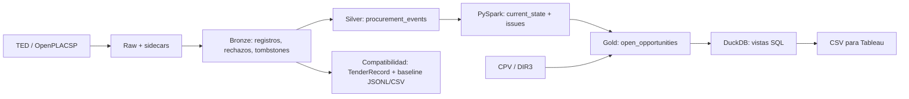

# Arquitectura

El sistema prepara datos de contratación pública para consultar oportunidades
por comprador, categoría e información publicada. Es un prototipo batch local,
con etapas ejecutables desde la CLI y fronteras persistidas en Parquet.

## Flujo implementado

| Etapa | Responsabilidad | Implementación |
| --- | --- | --- |
| Raw | Conservar payload, checksum e instante de recuperación | Python, JSONL/ZIP y sidecars |
| Bronze | Parsear formatos heterogéneos y contabilizar rechazos | Python XML/JSON, Polars, Parquet |
| Silver | Identidad, tipos, revisiones y tombstones históricos | Guarda Python, kernel Polars o referencia Python |
| Estado vigente | Resolver por procedimiento sin borrar el histórico | PySpark 4.0.1, ventanas y contratos tipados |
| Gold | Aplicar la política de oportunidad abierta y medir enriquecimiento | PySpark, Parquet y manifest |
| Analítica | Proyectar Gold y agregar por comprador, CPV y mes | DuckDB, SQL en `sql/duckdb/` |
| Presentación | Exportar tablas ordenadas y montar el dashboard | CSV determinista; Tableau manual |

`run` es offline: genera Bronze/Silver y el baseline de compatibilidad.
`build-gold` lee exclusivamente Silver canónico. Los comandos
`build-analytics` y `export-tableau` completan la cadena sin reinterpretar la
política de oportunidad abierta. Véase [reproducibilidad](reproducibility.md).

## Identidad y reproducibilidad

Raw conserva los bytes descargados; una corrección con checksum distinto
obtiene otro fichero. El sidecar es la evidencia local de recuperación y debe
viajar con el payload. Bronze conserva el localizador y las filas rechazadas.
Silver representa eventos publicados, no un snapshot destructivo. La identidad
se deriva de identificadores oficiales y, cuando corresponde, del tiempo de
la fuente. El reloj de ejecución no decide qué evento es más reciente.

El estado vigente agrupa por `procedure_id`, ya separado por fuente. Si varios
eventos compiten y no se pueden ordenar por `source_updated_at`, se registran
como incidencias. No se fusionan procedimientos entre fuentes en Gold.
El linkage heurístico pertenece al baseline de compatibilidad.

Los contratos y la política temporal están en el [contrato de datos](data_contract.md).
El determinismo de Spark se refiere a esquema y valores, no a nombres u orden
de sus part-files. DuckDB guarda vistas con rutas locales: al mover los datos
se reconstruye la base. Los CSV Tableau son productos derivados.

## Elección de motores

Polars procesa lotes locales y dimensiones. Silver inspecciona el lote completo:
si todas sus filas pertenecen al dominio admitido, usa el kernel nativo; una
sola fila fuera de dominio activa la referencia Python para todo el lote.
La referencia conserva la semántica de valores, procedencia y errores. Los
tests comparan ambas rutas, incluidos límites numéricos y temporales.

PySpark está implementado en estado vigente y Gold. Su candidato Silver
permanece aislado en `experiments/`; no es seleccionable desde el pipeline.
El [experimento](../experiments/silver_engine_comparison/README.md) compara
motores sobre un contrato sintético acotado. No demuestra que Spark mejore
Gold ni que exista un umbral universal de filas para elegir motor.

## Referencias y compatibilidad

CPV 2008 aporta la taxonomía oficial generalista. DIR3 añade información de
organismos cuando está disponible. Gold conserva los campos canónicos y
registra métricas de cobertura; los atributos CPV del análisis se incorporan
en DuckDB. Los detalles de construcción están en [referencias](references.md).

Se mantiene `TenderRecord`, el clasificador CPV/keywords, el linkage y sus
JSONL/CSV porque el comando `run` y sus consumidores siguen utilizándolos.
Esas salidas no alimentan DuckDB ni representan la política Gold actual.
Las dos referencias Python de Silver tienen propósitos distintos: una es el
fallback productivo y otra congela el experimento histórico.

## Límites y trabajo futuro

La descarga incluye TED y licitaciones OpenPLACSP; BOE está deshabilitado y
contratos menores no está integrado. Hay primitivas de estado de ingesta
probadas, pero la CLI aún no las compone para garantizar completitud de
ventanas. Tampoco refresca automáticamente meses cacheados.

Airflow, ingesta incremental completa, modelos semánticos preentrenados,
ranking por perfil, contratos menores y enriquecimiento geográfico adicional
son posibles extensiones. No hay despliegue cloud, streaming ni ejecución
multi-host del pipeline acreditada. La propuesta académica usa tecnología
como caso de estudio; los contratos canónicos admiten otros sectores.
